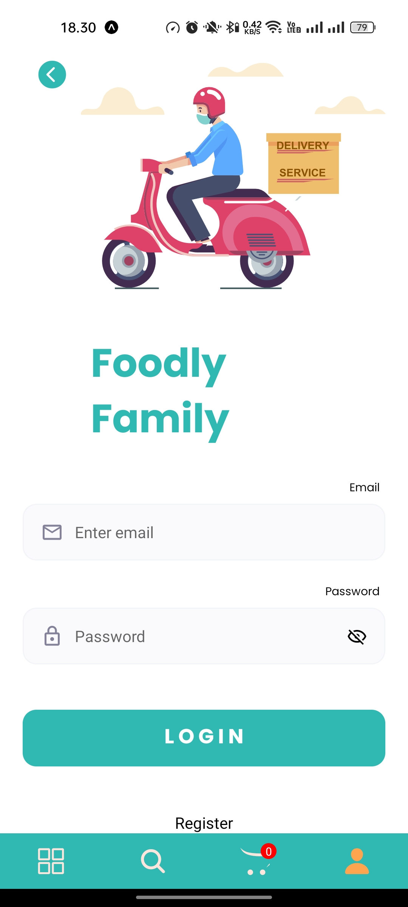
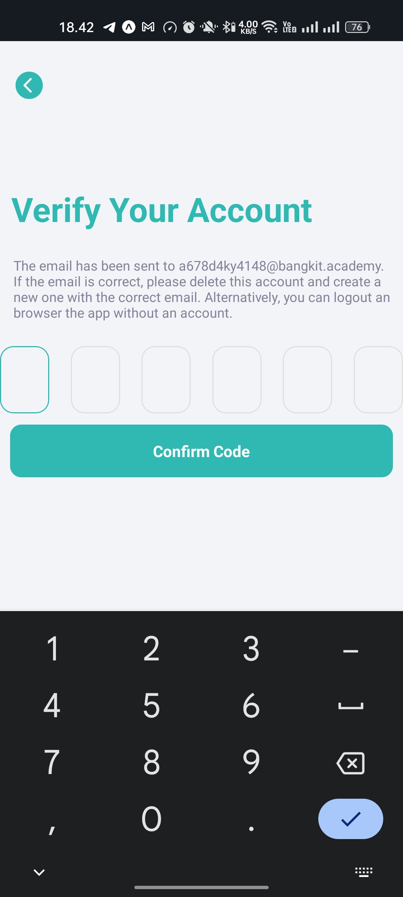
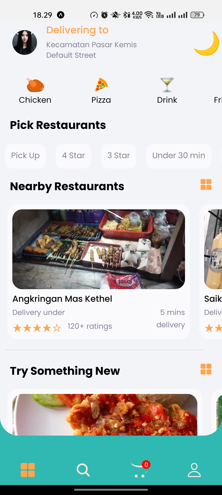
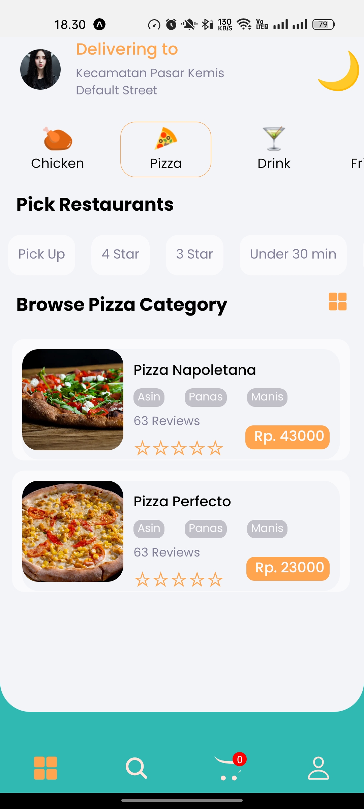
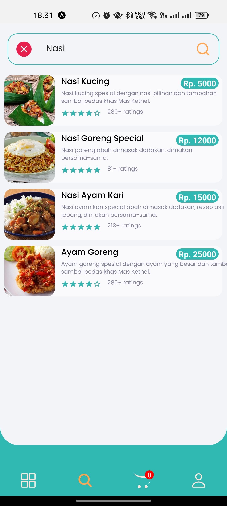
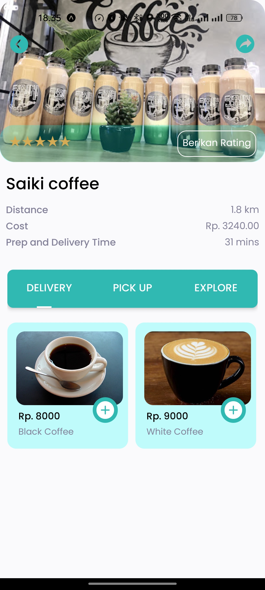
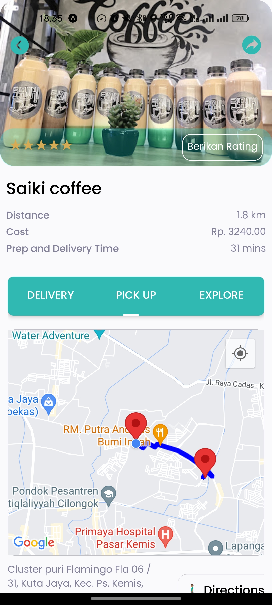
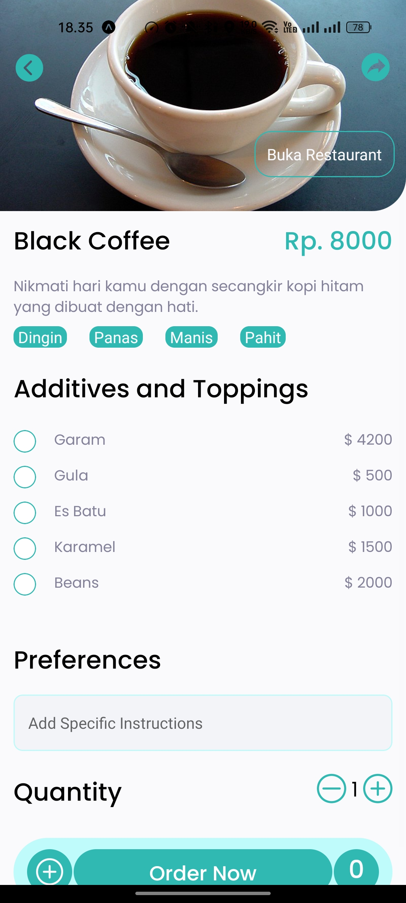
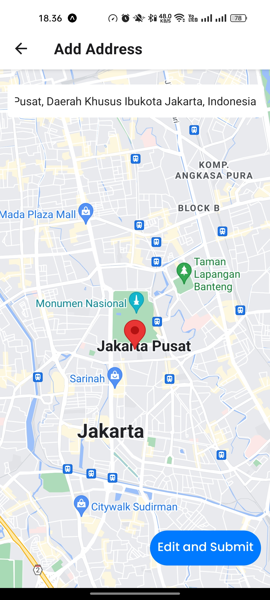

<p align="center"> 
   <a href="https://reactnative.dev/" target="_blank"> 
       
   </a> 
</p> 

<p align="center">
   <a href="https://reactnative.dev/"> 
      
   </a> 
   <a href="https://expo.dev/"> 
      
   </a> 
   <a href="https://firebase.google.com/"> 
      
   </a> 
</p>

---

## Overview

This frontend application is designed as the user interface for our project. Built using React Native and Expo, it allows users to interact with the backend services seamlessly. The app supports both Android and iOS platforms.

This project utilizes:

- **React Native and Expo**: For building cross-platform mobile applications.
- **Axios**: For HTTP requests and API communication.
- **Firebase**:
  - **@react-native-firebase/app**: Firebase core services integration.
  - **expo-notifications**: Handling push notifications.
- **Google Places API**: For location search and geocoding.
- **React Navigation**: For smooth navigation and routing.
- **Formik and Yup**: For form handling and validation.
- **dotenv**: For managing environment variables securely.
- **Lottie**: For rich animations.

---

## Features

- **User Authentication**: Users can register, log in, and manage their sessions securely.
- **Browse Food Menu**: View a wide variety of food items with images, descriptions, and prices.
- **Restaurant Listings**: Discover nearby restaurants with details like location, ratings, and contact information.
- **Food Order Management**: Place orders, track status, and view order history.
- **Location-based Services**: Integration with Google Places API for restaurant and address search.
- **Dynamic Address Management**: Add, edit, and delete user addresses seamlessly.
- **Push Notifications**: Stay updated with order status and promotional offers using Firebase Cloud Messaging.
- **User Reviews and Ratings**: Rate food items and restaurants and view community feedback.
- **Rich Animations**: Delightful UI with smooth Lottie animations.
- **Offline Mode**: Access limited functionality even without an internet connection.

---

## Preview

Here are some screenshots showcasing the app:

<p align="center">
   
   
   
   
   
   
   
   
   
</p>

---

## Installation

### Prerequisites

Ensure you have the following installed:

- [Node.js](https://nodejs.org/) (v16 or higher)
- [npm](https://www.npmjs.com/) or [yarn](https://yarnpkg.com/)
- [Expo CLI](https://docs.expo.dev/get-started/installation/)
- Android/iOS Emulator or a physical device with Expo Go
- A `.env` file with the required environment variables

### Steps to Install

1. Clone the repository:

   ```bash
   git clone https://github.com/kisahtegar/foodly_app.git
   cd foodly_frontend
   ```

2. Install dependencies:

   ```bash
   npm install
   # or
   yarn install
   ```

3. Set up environment variables: Create a `.env` file in the root directory and add the following variables:

   ```env
   BASE_URL=http://192.168.0.20:6003
   GOOGLE_API_KEY=your_api_key
   ```

4. Configure Google Cloud APIs:

   - Sign in to your [Google Cloud Console](https://console.cloud.google.com/).
   - Create a new project or use an existing one.
   - Enable the following APIs in the Google Cloud Console:
     - Directions API
     - Distance Matrix API
     - Geocoding API
     - Maps SDK for Android
     - Maps SDK for iOS
     - Routes API
     - Places API
   - Generate an API key and restrict its usage for security.
   - Add the generated API key to your `.env` file under `GOOGLE_API_KEY`.

5. Set up Firebase:

   - Download the `google-services.json` file from your Firebase project settings and place it in the root of your project.
   - Install Firebase SDK:

     ```bash
     npm install firebase
     ```

   - Initialize Firebase in your project:

     ```javascript
     // firebaseConfig.js
     import firebase from "firebase/compat/app";
     import "firebase/compat/auth";
     import "firebase/compat/firestore";

     const firebaseConfig = {
       apiKey: "your_api_key",
       authDomain: "your_auth_domain",
       databaseURL: "your_database_url",
       projectId: "your_project_id",
       storageBucket: "your_storage_bucket",
       messagingSenderId: "your_messaging_sender_id",
       appId: "your_app_id",
       measurementId: "your_measurement_id",
     };

     if (!firebase.apps.length) {
       firebase.initializeApp(firebaseConfig);
     }

     export { firebase };
     ```

By following these steps, your Firebase services will be configured securely.

---

## Usage

### Running the App

Start the development server:

```bash
npx expo start
```

- Use the QR code to open the app in Expo Go (iOS/Android).

### Building for Production

1. Build the project for Android/iOS:

   ```bash
   eas build
   ```

2. Follow Expo's documentation for publishing your app: [Expo Build and Deploy](https://docs.expo.dev/build/introduction/).

---

## API Integration

This frontend interacts with the backend API. Ensure the backend server is running and the API URL is correctly set in the `.env` file.

---

## Contributing

Contributions are welcome! Please follow these steps:

1. Fork the project.
2. Create a new branch (`git checkout -b feature/my-feature`).
3. Commit your changes (`git commit -m 'Add feature'`).
4. Push the branch (`git push origin feature/my-feature`).
5. Submit a pull request.

---

## ✨ About Us

- 💻 All of my projects are available at [github.com/kisahtegar](https://github.com/kisahtegar)
- 📫 How to reach me **<code.kisahtegar@gmail.com>**
- 📄 Know about my experiences [kisahcode.web.app](https://kisahcode.web.app)
